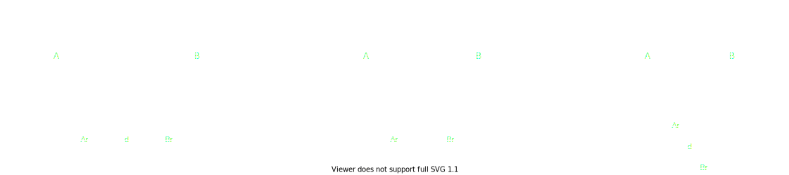
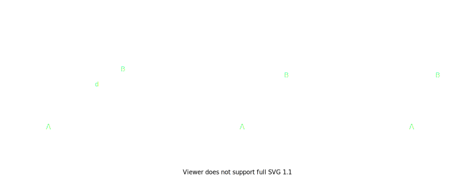

Physics in the game is implemented using a similar pattern to rendering. There is a `PhysicsComponent` that entities can have that will register the entity with a `PhysicsService`. This also adds some more state to the entity that other components can interact with.

```ts
export interface PhysicsState {
    velocity: Vector2D;
    heightVelocity: number;
    friction: number;
    mass: number;
    elastic: number;
    collidesEntities: boolean;
    collidesWalls: boolean;
}

export const PhysicsComponent = (): EntityComponent<PhysicsStateType> => {
    let physicsRegistration: PhysicsRegistration;

    return {
        getActions: (entity: Entity<PhysicsStateType>) => ({
            onEntityCreated: () => {
                const { collidesEntities, collidesWalls } = entity.getState();
                physicsRegistration = {
                    collidesWalls,
                    collidesEntities,
                    setHeight: (height: number) => entity.setState({ height }),
                    setHeightVelocity: (heightVelocity: number) =>
                        entity.setState({ heightVelocity }),
                    setVelocity: (x, y) =>
                        entity.setState({ velocity: { x, y } }),
                    setPosition: (x, y) =>
                        entity.setState({ position: { x, y } }),
                    getPhysicsInformation: () => entity.getState(),
                };
                entity
                    .getServiceLocator()
                    .getPhysicsService()
                    .registerPhysicsEntity(physicsRegistration);
            },
            onEntityDeleted: () => {
                entity
                    .getServiceLocator()
                    .getPhysicsService()
                    .unregisterPhysicsEntity(physicsRegistration);
            },
        }),
    };
};
```

This component is a bit different to the render component in that it provides function callbacks as part of this registration. This is so the `PhysicsService` can change the entity's attributes when resolving things like collisions. The physics service is fairly simple in that it resolves some simple 2D collisions. It focuses on applying forces to an entity rather than directly changing its position or velocity. This is beneficial, as it results in smoother collisions when multiple entities are colliding with each other (this can look jittery otherwise). Every frame, the physics service batch processes the entity collisions to produce a change in velocity. It then applies these to all the entities at once. This also helps when moving an entity would then result in it colliding with another entity, processed in the same frame:

```ts
public update() {
    for (const entity of entities) {
        this.calculateEntityGravityCollisionImpulse(entity);
        this.calculateEntityCollisionImpulse(entity, entities);
    }

    for (const entity of entities) {
        this.calculateEntityBoundaryCollisionImpulse(entity, boundaries);
    }

    this.moveEntities(entities);
}
```

`calculateEntityGravityCollisionImpulse` calculates the height velocity when the entity is above the ground; the `calculateEntityCollisionImpulse` resolves collisions between entities; and the `calculateEntityBoundaryCollisionImpulse` resolves collisions between the entities and the boundaries (walls). The entity collision is resolved by treating each entity as a ball that can bounce off of others:



Here we can calculate an entity's displacement within once another by taking its position and radius:

```
displacement = distance(A - B) - Ar - Br

if displacement > 0 then not colliding
else colliding
```

When entities collide, we add to their velocity with a force proportional to how deep into each other they are displaced. This causes entities to bounce off of each other in a smooth way. A force constant can be used to tune how much entities repel.

```
force = displacement * FORCE_CONSTANT 
velocity = velocity + force / mass
```

This usually results in entities slowly moving away from each other rather than stopping them from being displaced in a single frame. For entity to boundary collision, we don't want entities to be able to be displaced within the wall in the next frame. Otherwise, with enough speed, the entity could go through the wall. This means the entity and wall collision resolution is more complex. It must first negate any speed going into the wall and also repel the entity depending on how displaced the entity already is within the wall. This is calculated using the normal vector.



We first need to find the displacement of the circle into the line. This is worked out by finding the where on the line A would be if B was the axis. The dot product from the centre of A to the line provides this value. If the dot product is negative or greater than 1, then it means the closest point is off the line so it's clipped to be between these values.

```
BDistX = B2x - B1x;
BDistY = B2y - B2y;

BLength = sqrt(BDistX ^ 2 + BDistY ^ 2);
DotProduct = ((Ax - B1x) * (B2x - B1x) + (Ay - B1y) * (B2y - B1y)) / BLength ^ 2

DotProduct = min(1, max(DotProduct, 0));

ClosestX = B1x + DotProduct * BDistX;
ClosestY = B1y + DotProduct * BDistY;
```

Now we have the closest point on the line to the entity circle. The displacement is worked out using the distance from this point to the circle, similar to the entity to entity collision equation. 

```
DifferenceX = Ax - ClosestX
DifferenceY = Ay - ClosestY

CircleLineDistance = sqrt(DifferenceX ^ 2 + DifferenceY ^ 2);

if CircleLineDistance > Ar then not colliding
```

We can then work out what the force upon the entity is by working out what its current velocity towards line is, negate it to stop the movement, then apply further force to bounce it off of the wall:

```
NormalX = DifferenceX / CircleLineDistance
NormalY = DifferenceY / CircleLineDistance

SpeedAlongNormal = NormalX * AVx + NormalY * AVy

Force = SpeedAlongNormal * ELASTIC_CONSTANT

Velocity = Velocity + Force
```

This is implemented in Typescript inside the `PhysicsService` and what prevents entities and the player from walking through walls in the game; and allow the entities to push and be pushed by the player.